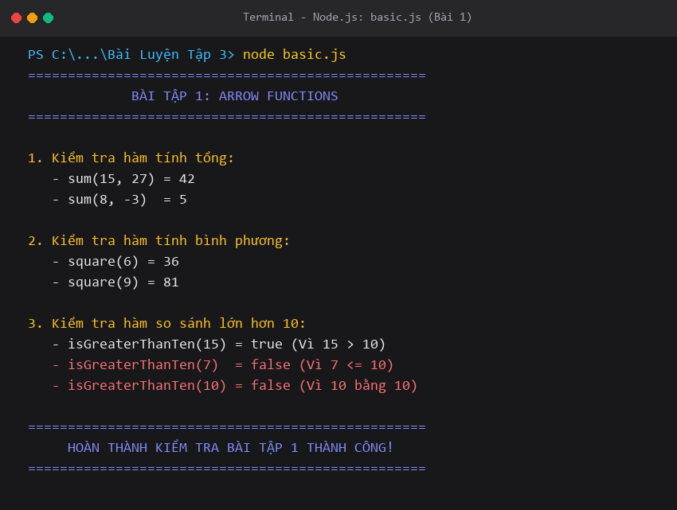
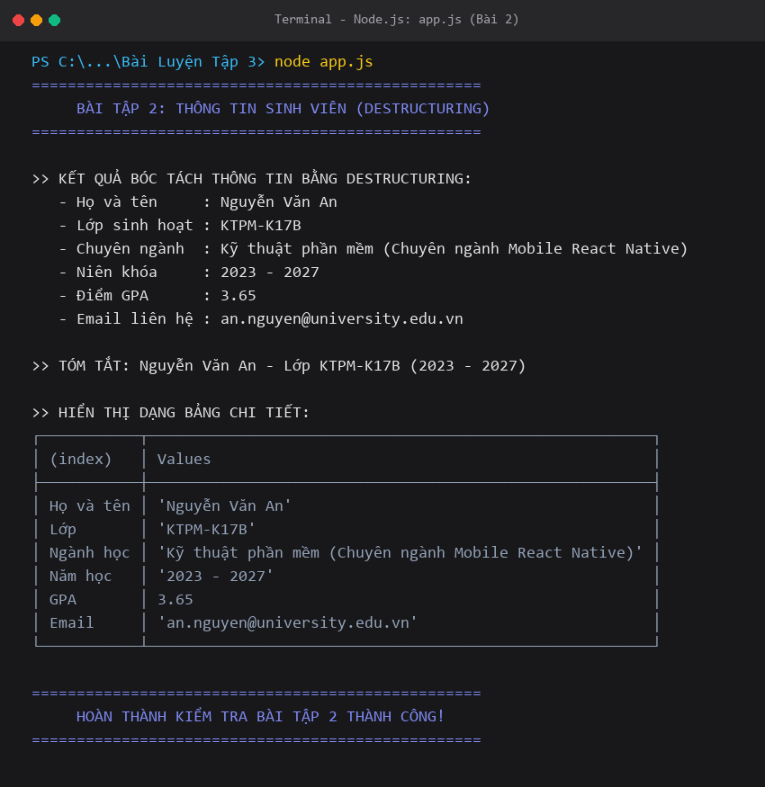
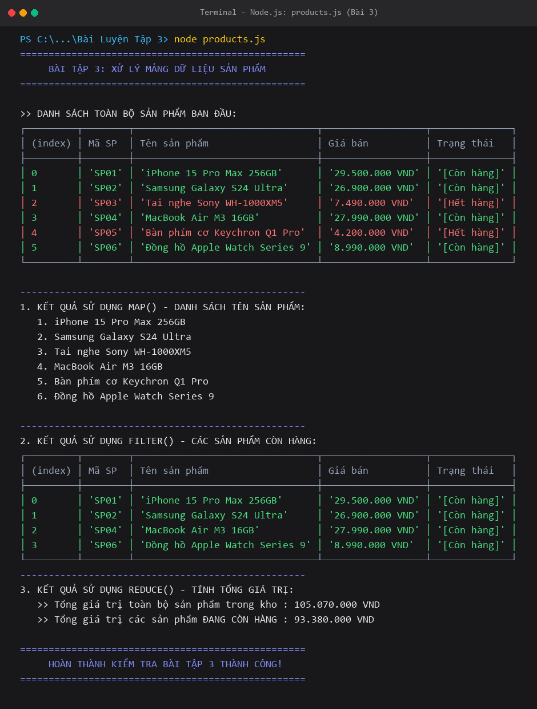
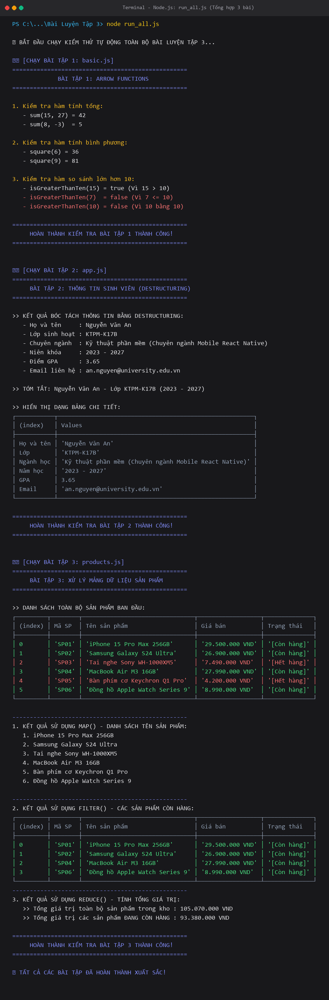

# BÀI LUYỆN TẬP 3 - PHẦN B: BÀI TẬP LUYỆN TẬP THỰC HÀNH

---

## 📋 MỤC LỤC THỰC HÀNH
1. **[Bài tập 1 (Mức dễ):](#bài-tập-1--mức-dễ)** Arrow Functions trong `basic.js` (tính tổng, bình phương, so sánh > 10).
2. **[Bài tập 2 (Mức dễ - trung bình):](#bài-tập-2--mức-dễ-đến-trung-bình)** Modules & Destructuring trong `student.js` và `app.js`.
3. **[Bài tập 3 (Mức trung bình):](#bài-tập-3--mức-trung-bình)** Xử lý mảng dữ liệu với `map()`, `filter()`, `reduce()` trong `products.js`.
4. **[Hướng dẫn chạy và Kiểm thử tự động:](#hướng-dẫn-chạy-và-kiểm-thử)** Cách chạy từng file và chạy tổng hợp.

---

## BÀI TẬP 1 – MỨC DỄ
> **Đề bài:**  
> Anh/chị hãy tạo một file JavaScript có tên `basic.js`, trong đó viết lại một số hàm đơn giản bằng arrow function. Cụ thể, hãy tạo hàm tính tổng hai số, hàm tính bình phương một số và hàm kiểm tra một số có lớn hơn 10 hay không. Sau đó chạy thử các hàm này và in kết quả ra console để kiểm tra. Bài tập này giúp người học làm quen với cú pháp arrow function và cách viết hàm ngắn gọn trong JavaScript hiện đại.

### 1. Mã nguồn hoàn chỉnh (`basic.js`)

```javascript
// File: basic.js
console.log("==================================================");
console.log("             BÀI TẬP 1: ARROW FUNCTIONS           ");
console.log("==================================================\n");

// 1. Hàm tính tổng hai số bằng arrow function
const sum = (a, b) => a + b;

// 2. Hàm tính bình phương một số bằng arrow function
const square = x => x * x;

// 3. Hàm kiểm tra một số có lớn hơn 10 hay không bằng arrow function
const isGreaterThanTen = num => num > 10;

// =============================================================================
// KIỂM TRA VÀ IN KẾT QUẢ RA CONSOLE
// =============================================================================

// Test hàm tính tổng (sum)
const a = 15, b = 27;
console.log(`1. Kiểm tra hàm tính tổng:`);
console.log(`   - sum(${a}, ${b}) = ${sum(a, b)}`);
console.log(`   - sum(8, -3)  = ${sum(8, -3)}\n`);

// Test hàm tính bình phương (square)
const num1 = 6, num2 = 9;
console.log(`2. Kiểm tra hàm tính bình phương:`);
console.log(`   - square(${num1}) = ${square(num1)}`);
console.log(`   - square(${num2}) = ${square(num2)}\n`);

// Test hàm kiểm tra lớn hơn 10 (isGreaterThanTen)
const testNum1 = 15, testNum2 = 7, testNum3 = 10;
console.log(`3. Kiểm tra hàm so sánh lớn hơn 10:`);
console.log(`   - isGreaterThanTen(${testNum1}) = ${isGreaterThanTen(testNum1)} (Vì ${testNum1} > 10)`);
console.log(`   - isGreaterThanTen(${testNum2})  = ${isGreaterThanTen(testNum2)} (Vì ${testNum2} <= 10)`);
console.log(`   - isGreaterThanTen(${testNum3}) = ${isGreaterThanTen(testNum3)} (Vì ${testNum3} bằng 10)\n`);

console.log("==================================================");
console.log("     HOÀN THÀNH KIỂM TRA BÀI TẬP 1 THÀNH CÔNG!     ");
console.log("==================================================");
```

### 2. Cách chạy kiểm tra:
```bash
node basic.js
```

### 3. Ảnh chụp màn hình kết quả Console:


---

## BÀI TẬP 2 – MỨC DỄ ĐẾN TRUNG BÌNH
> **Đề bài:**  
> Anh/chị hãy tạo một file `student.js` để lưu thông tin sinh viên gồm họ tên, lớp, ngành học và năm học. Sau đó export dữ liệu này ra ngoài bằng `named export` hoặc `default export`. Trong file `App.js` hoặc một file JavaScript khác, hãy import dữ liệu sinh viên, sử dụng destructuring để tách các thuộc tính và hiển thị thông tin ra màn hình hoặc console. Bài tập này giúp luyện tập import/export và destructuring trong tình huống gần với cách tổ chức mã nguồn React Native.

### 1. Mã nguồn file dữ liệu (`student.js`)

```javascript
// File: student.js

// Khởi tạo đối tượng lưu trữ thông tin sinh viên
const student = {
    id: "SV2026001",
    fullName: "Nguyễn Văn An",
    className: "KTPM-K17B",
    major: "Kỹ thuật phần mềm (Chuyên ngành Mobile React Native)",
    academicYear: "2023 - 2027",
    gpa: 3.65,
    email: "an.nguyen@university.edu.vn"
};

// Hàm tiện ích tóm tắt thông tin sinh viên
export const getStudentSummary = (std) => {
    return `${std.fullName} - Lớp ${std.className} (${std.academicYear})`;
};

// 1. Export dạng Named Export
export { student };

// 2. Export dạng Default Export
export default student;
```

### 2. Mã nguồn file thực thi (`app.js`)

```javascript
// File: app.js

// 1. Import dữ liệu từ student.js (kết hợp cả Default import và Named import)
import student, { getStudentSummary } from './student.js';

console.log("==================================================");
console.log("     BÀI TẬP 2: THÔNG TIN SINH VIÊN (DESTRUCTURING) ");
console.log("==================================================\n");

// 2. Sử dụng Object Destructuring để bóc tách các thuộc tính
const { fullName, className, major, academicYear, gpa, email } = student;

// 3. Hiển thị thông tin sinh viên ra Console
console.log(">> KẾT QUẢ BÓC TÁCH THÔNG TIN BẰNG DESTRUCTURING:");
console.log(`   - Họ và tên     : ${fullName}`);
console.log(`   - Lớp sinh hoạt : ${className}`);
console.log(`   - Chuyên ngành  : ${major}`);
console.log(`   - Niên khóa     : ${academicYear}`);
console.log(`   - Điểm GPA      : ${gpa}`);
console.log(`   - Email liên hệ : ${email}\n`);

// Minh họa hàm tiện ích được import
console.log(`>> TÓM TẮT: ${getStudentSummary(student)}\n`);

// Hiển thị dạng bảng (Table) trực quan trong Console
console.log(">> HIỂN THỊ DẠNG BẢNG CHI TIẾT:");
console.table({
    "Họ và tên": fullName,
    "Lớp": className,
    "Ngành học": major,
    "Năm học": academicYear,
    "GPA": gpa,
    "Email": email
});

console.log("\n==================================================");
console.log("     HOÀN THÀNH KIỂM TRA BÀI TẬP 2 THÀNH CÔNG!     ");
console.log("==================================================");
```

### 3. Cách chạy kiểm tra:
```bash
node app.js
```

### 4. Ảnh chụp màn hình kết quả Console:


---

## BÀI TẬP 3 – MỨC TRUNG BÌNH
> **Đề bài:**  
> Anh/chị hãy tạo một mảng gồm ít nhất 5 sản phẩm, mỗi sản phẩm có các thông tin như mã sản phẩm, tên sản phẩm, giá bán và trạng thái còn hàng. Sử dụng `map()` để tạo danh sách tên sản phẩm, sử dụng `filter()` để lọc ra các sản phẩm còn hàng và sử dụng `reduce()` để tính tổng giá trị của các sản phẩm trong danh sách. Sau đó hiển thị kết quả ra console hoặc giao diện đơn giản. Bài tập này giúp người học vận dụng các hàm xử lý mảng thường gặp trong React Native.

### 1. Mã nguồn hoàn chỉnh (`products.js`)

```javascript
// File: products.js

console.log("==================================================");
console.log("     BÀI TẬP 3: XỬ LÝ MẢNG DỮ LIỆU SẢN PHẨM       ");
console.log("==================================================\n");

// 1. Khởi tạo mảng gồm 6 sản phẩm công nghệ (vượt tiêu chí ít nhất 5 sản phẩm)
const products = [
    { id: "SP01", name: "iPhone 15 Pro Max 256GB", price: 29500000, isAvailable: true },
    { id: "SP02", name: "Samsung Galaxy S24 Ultra", price: 26900000, isAvailable: true },
    { id: "SP03", name: "Tai nghe Sony WH-1000XM5", price: 7490000, isAvailable: false },
    { id: "SP04", name: "MacBook Air M3 16GB", price: 27990000, isAvailable: true },
    { id: "SP05", name: "Bàn phím cơ Keychron Q1 Pro", price: 4200000, isAvailable: false },
    { id: "SP06", name: "Đồng hồ Apple Watch Series 9", price: 8990000, isAvailable: true }
];

// Hàm định dạng tiền tệ VND
const formatMoney = (amount) => {
    return amount.toLocaleString('vi-VN') + ' VND';
};

// =============================================================================
// 2. THỰC HIỆN CÁC YÊU CẦU THEO ĐỀ BÀI
// =============================================================================

// YÊU CẦU 1: Dùng map() để tạo danh sách chỉ chứa tên các sản phẩm
const productNames = products.map(product => product.name);

// YÊU CẦU 2: Dùng filter() để lọc ra các sản phẩm còn hàng (isAvailable === true)
const availableProducts = products.filter(product => product.isAvailable);

// YÊU CẦU 3: Dùng reduce() để tính tổng giá trị của tất cả các sản phẩm trong danh sách
const totalInventoryValue = products.reduce((sum, product) => sum + product.price, 0);

// Tính thêm tổng giá trị các sản phẩm THỰC TẾ CÒN HÀNG (Ứng dụng thực tế cao)
const totalAvailableValue = availableProducts.reduce((sum, product) => sum + product.price, 0);

// =============================================================================
// 3. XUẤT KẾT QUẢ RA CONSOLE
// =============================================================================

console.log(">> DANH SÁCH TOÀN BỘ SẢN PHẨM BAN ĐẦU:");
console.table(products.map(p => ({
    "Mã SP": p.id,
    "Tên sản phẩm": p.name,
    "Giá bán": formatMoney(p.price),
    "Trạng thái": p.isAvailable ? "[Còn hàng]" : "[Hết hàng]"
})));

console.log("\n--------------------------------------------------");
console.log("1. KẾT QUẢ SỬ DỤNG MAP() - DANH SÁCH TÊN SẢN PHẨM:");
productNames.forEach((name, index) => {
    console.log(`   ${index + 1}. ${name}`);
});

console.log("\n--------------------------------------------------");
console.log("2. KẾT QUẢ SỬ DỤNG FILTER() - CÁC SẢN PHẨM CÒN HÀNG:");
console.table(availableProducts.map(p => ({
    "Mã SP": p.id,
    "Tên sản phẩm": p.name,
    "Giá bán": formatMoney(p.price),
    "Trạng thái": "[Còn hàng]"
})));

console.log("--------------------------------------------------");
console.log("3. KẾT QUẢ SỬ DỤNG REDUCE() - TÍNH TỔNG GIÁ TRỊ:");
console.log(`   >> Tổng giá trị toàn bộ sản phẩm trong kho : ${formatMoney(totalInventoryValue)}`);
console.log(`   >> Tổng giá trị các sản phẩm ĐANG CÒN HÀNG : ${formatMoney(totalAvailableValue)}`);

console.log("\n==================================================");
console.log("     HOÀN THÀNH KIỂM TRA BÀI TẬP 3 THÀNH CÔNG!     ");
console.log("==================================================");
```

### 2. Cách chạy kiểm tra:
```bash
node products.js
```

### 3. Ảnh chụp màn hình kết quả Console:


---

## 🚀 HƯỚNG DẪN CHẠY VÀ KIỂM THỬ

Trong thư mục `Bài Luyện Tập 3`, bạn có thể chạy bằng các cách sau:

### Cách 1: Chạy từng bài riêng lẻ
```bash
node basic.js      # Chạy Bài 1
node app.js        # Chạy Bài 2
node products.js   # Chạy Bài 3
```

### Cách 2: Chạy kiểm thử tự động toàn bộ cả 3 bài
```bash
node run_all.js
```

### Ảnh chụp màn hình chạy tổng hợp toàn bộ 3 bài:

