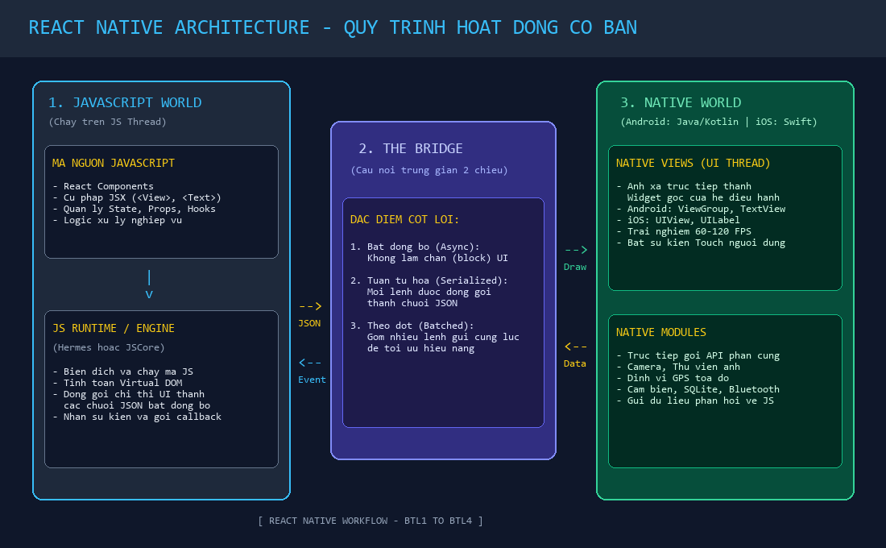

# BÀI LUYỆN TẬP 4 - PHẦN B: BÀI TẬP LUYỆN TẬP THỰC HÀNH

---

## 📋 MỤC LỤC THỰC HÀNH
1. **[Bài tập 1 (Mức dễ):](#bài-tập-1--mức-dễ)** Sơ đồ quy trình hoạt động của React Native & Giải thích cơ chế giao diện Native.
2. **[Bài tập 2 (Mức dễ - trung bình):](#bài-tập-2--mức-dễ-đến-trung-bình)** Danh sách công cụ & Kế hoạch thiết lập môi trường trên Windows; Phân tích giới hạn build iOS.
3. **[Bài tập 3 (Mức trung bình):](#bài-tập-3--mức-trung-bình)** Kế hoạch thiết lập môi trường phát triển toàn diện trên macOS (cả iOS và Android).

---

## BÀI TẬP 1 – MỨC DỄ
> **Đề bài:**  
> Em hãy vẽ hoặc mô tả bằng lời sơ đồ hoạt động của React Native theo thứ tự: mã JavaScript, JavaScript runtime, Bridge, native module hoặc native UI, ứng dụng native xử lý yêu cầu và trả kết quả về cho JavaScript. Sau khi hoàn thành, em cần viết một đoạn ngắn giải thích vì sao React Native có thể dùng JavaScript để xây dựng giao diện gần giống ứng dụng native.

### 1. Sơ đồ quy trình hoạt động của React Native

#### Sơ đồ trực quan dạng khối (Mermaid Architecture):

```mermaid
flowchart TD
    subgraph JS_World["1. JavaScript World (JS Thread)"]
        A["Mã nguồn JavaScript / JSX\n(<View>, <Text>, Logic, State)"] --> B["JavaScript Runtime / Engine\n(Hermes / JavaScriptCore)"]
        B -->|Đóng gói lệnh JSON| C["Chuỗi thông điệp JSON"]
    end

    subgraph Bridge_Layer["2. Cầu nối trung gian (The Bridge)"]
        C --> D["THE BRIDGE\n(Giao tiếp 2 chiều, Bất đồng bộ)"]
        H["Dữ liệu sự kiện / Kết quả"] -->|Gửi ngược JSON| D
    end

    subgraph Native_World["3. Native World (UI & Background Threads)"]
        D -->|Lệnh vẽ UI| E["Native Views / Native UI\n(Android: ViewGroup, TextView\niOS: UIView, UILabel)"]
        D -->|Yêu cầu phần cứng| F["Native Modules\n(Camera, GPS, SQLite, Sensors)"]
        
        E --> G["Hệ điều hành Android / iOS\n(Hiển thị màn hình & Bắt tương tác Touch)"]
        F --> G
        G -->|Touch Event / Hardware Callback| H
    end

    D -->|Kích hoạt callback (onPress, API data)| B

    style JS_World fill:#1e293b,stroke:#38bdf8,stroke-width:2px,color:#fff
    style Bridge_Layer fill:#312e81,stroke:#818cf8,stroke-width:2px,color:#fff
    style Native_World fill:#064e3b,stroke:#34d399,stroke-width:2px,color:#fff
```

#### Sơ đồ dạng hình ảnh minh họa:


---

### 2. Thuyết minh chi tiết quy trình 5 bước theo thứ tự đề bài:

1. **Mã JavaScript:** Lập trình viên viết mã bằng JavaScript kết hợp cú pháp JSX để mô tả các component giao diện (`<View>`, `<Text>`, `<Button>`) và định nghĩa logic nghiệp vụ.
2. **JavaScript Runtime (Engine):** Toàn bộ mã trên được nạp vào máy ảo JavaScript (như Hermes hoặc JavaScriptCore) chạy trên luồng JavaScript riêng biệt. Runtime thực thi logic, tính toán trạng thái (State/Props) và tạo ra cây giao diện ảo (Virtual Tree).
3. **The Bridge (Cầu nối):** Khi cần cập nhật giao diện hoặc truy cập phần cứng, JavaScript Runtime không thể gọi trực tiếp mã máy của hệ điều hành. Thay vào đó, nó đóng gói các mệnh lệnh thành chuỗi văn bản JSON tuần tự và gửi bất đồng bộ qua **Bridge**.
4. **Native Module hoặc Native UI tiếp nhận:**
   - Nếu là lệnh vẽ giao diện: Tầng Native giải mã JSON và gọi **Native UI** tương ứng của hệ điều hành (`ViewGroup` trên Android, `UIView` trên iOS).
   - Nếu là lệnh phần cứng: Gọi các **Native Modules** viết bằng Java/Kotlin hoặc Swift để mở Camera, đọc GPS, lấy dữ liệu cảm biến.
5. **Ứng dụng Native xử lý yêu cầu và trả kết quả về cho JavaScript:**
   - Hệ điều hành hiển thị chính xác các thành phần giao diện gốc lên màn hình và tiếp nhận thao tác chạm (Touch Events) của người dùng.
   - Khi có sự kiện người dùng bấm nút hoặc phần cứng hoàn thành tác vụ, tầng Native đóng gói dữ liệu thành JSON và gửi ngược qua Bridge về JavaScript Runtime. Tại đây, hàm xử lý (như `onPress`) được kích hoạt, hoàn tất một vòng lặp tương tác khép kín.

---

### 3. Đoạn văn giải thích vì sao React Native có thể tạo ra giao diện gần giống Native:
> *"React Native có thể tạo ra giao diện và trải nghiệm cảm ứng mượt mà gần như tuyệt đối giống ứng dụng Native thuần túy là nhờ vào **cơ chế ánh xạ thành phần gốc (Native Components Mapping) thay vì sử dụng trình duyệt nhúng (WebView)**. Khi lập trình viên viết một thẻ `<Text>` hoặc `<View>` trong JavaScript, React Native không hề tạo ra các thẻ HTML `<div>` hay `<p>` giả lập. Thay vào đó, thông qua tầng cầu nối Bridge, nó trực tiếp yêu cầu hệ điều hành Android khởi tạo một đối tượng `android.widget.TextView` và yêu cầu iOS tạo một đối tượng `UILabel` chính thống. Vì các widget cuối cùng hiển thị trên mắt người dùng chính là các thành phần đồ họa do Apple và Google lập trình sẵn, nên mọi chuyển động cuộn trang, gia tốc quán tính, hiệu ứng bóng đổ và độ phản hồi cảm ứng đều là của hệ điều hành gốc 100%."*

---

## BÀI TẬP 2 – MỨC DỄ ĐẾN TRUNG BÌNH
> **Đề bài:**  
> Em hãy lập danh sách các công cụ cần chuẩn bị để cài đặt môi trường React Native trên hệ điều hành Windows. Trong bài làm cần nêu vai trò của Chocolatey, Node.js, Java JDK, Python, Android Studio, Android SDK và Visual Studio Code. Sau đó, giải thích vì sao trên Windows chỉ có thể build ứng dụng Android mà không build trực tiếp được ứng dụng iOS.

### 1. Bảng danh sách và vai trò của các công cụ trên hệ điều hành Windows

| STT | Tên công cụ | Vai trò cụ thể trong môi trường phát triển |
| :---: | :--- | :--- |
| **1** | **Chocolatey** (`choco`) | **Trình quản lý gói cho Windows (Windows Package Manager):** Cho phép tự động hóa quá trình tải về, cài đặt và nâng cấp các công cụ lập trình (Node.js, JDK, Python) thông qua dòng lệnh một cách nhanh chóng, chuẩn xác, tự động cấu hình biến môi trường mà không cần tải file `.exe` thủ công. |
| **2** | **Node.js** | **Môi trường thực thi JavaScript:** Nền tảng bắt buộc để chạy máy chủ đóng gói mã nguồn **Metro Bundler** (chuyển đổi mã JS/JSX thành bundle nạp vào ứng dụng) và cung cấp trình quản lý thư viện **npm / yarn**. |
| **3** | **Java JDK (Khuyên dùng JDK 17)** | **Bộ phát triển Java (Java Development Kit):** Công cụ biên dịch mã nguồn phía Android, đồng thời là môi trường runtime bắt buộc để hệ thống tự động hóa build **Gradle** của Android vận hành. |
| **4** | **Python (Python 2 / 3)** | **Trình thông dịch hỗ trợ biên dịch mã gốc:** Một số thư viện React Native chứa mã C/C++ cần Python làm công cụ trung gian (thông qua `node-gyp`) trong quá trình liên kết và build mã nguồn tầng thấp trên Windows. |
| **5** | **Android Studio** | **Môi trường phát triển tích hợp (IDE) chính thức của Google:** Cung cấp giao diện đồ họa quản lý hệ thống Android, tích hợp công cụ kiểm thử hiệu năng (Profiler), bộ gỡ lỗi Logcat và quản lý thiết bị ảo (Device Manager). |
| **6** | **Android SDK (Software Development Kit)** | **Bộ công cụ phát triển phần mềm Android:** Chứa các thư viện API của hệ điều hành Android, công cụ kết nối gỡ lỗi thiết bị `adb` (*Android Debug Bridge*), trình biên dịch `build-tools`, và các file ảnh hệ điều hành (System Images) để tạo file cài đặt APK. |
| **7** | **Visual Studio Code (VS Code)** | **Trình soạn thảo mã nguồn chính (Code Editor):** Nơi lập trình viên trực tiếp viết code JS/JSX; cung cấp kho extension hỗ trợ đắc lực như React Native Tools, tô màu cú pháp, tự động gợi ý code (IntelliSense) và định dạng chuẩn (Prettier). |

---

### 2. Giải thích vì sao trên Windows chỉ build được Android mà KHÔNG build trực tiếp được iOS?

1. **Rào cản độc quyền từ phía Apple:**
   - Để biên dịch mã nguồn iOS (ngôn ngữ Objective-C, Swift) thành gói cài đặt ứng dụng iPhone/iPad (`.ipa`), bắt buộc phải sử dụng bộ công cụ phát triển **Xcode** và tiện ích dòng lệnh `xcodebuild`.
   - Apple giữ độc quyền tuyệt đối: **Xcode và iOS SDK chỉ được phát hành và chỉ có thể cài đặt trên hệ điều hành macOS**. Apple hoàn toàn không cung cấp phiên bản Xcode hay chuỗi công cụ biên dịch iOS nào chạy trên Windows hay Linux.
2. **Cơ chế ký số và chứng chỉ bảo mật của Apple:**
   - Quá trình đóng gói ứng dụng iOS đòi hỏi công cụ quản lý chứng chỉ số Keychain và chứng chỉ lập trình viên (Apple Developer Certificate / Provisioning Profile) được tích hợp sâu trong nhân của hệ điều hành macOS.
3. **Tại sao Android thì làm được trên Windows?**
   - Trái ngược với Apple, Google định hướng hệ sinh thái Android theo mô hình **mã nguồn mở và đa nền tảng**. Toàn bộ Android SDK, máy ảo AVD và công cụ biên dịch Gradle đều được thiết kế để chạy mượt mà trên cả Windows, macOS và Linux.
   - *Hệ quả thực tế:* Lập trình viên sử dụng máy tính Windows chỉ có thể build và chạy thử nghiệm trực tiếp ứng dụng trên Android. Muốn build cho iOS, người dùng Windows phải sử dụng dịch vụ đám mây (như Expo EAS Build) hoặc kết nối từ xa đến một máy Mac thực tế.

---

## BÀI TẬP 3 – MỨC TRUNG BÌNH
> **Đề bài:**  
> Em hãy lập kế hoạch cài đặt môi trường React Native trên macOS. Nội dung cần trình bày các bước cài đặt Brew, Node.js, Watchman, React Native CLI và Xcode. Nếu muốn chạy ứng dụng Android trên macOS, em cần bổ sung thêm những công cụ nào? Hãy giải thích vai trò của từng công cụ trong quá trình phát triển ứng dụng.

---

### 1. Kế hoạch từng bước cài đặt môi trường React Native trên macOS (Hỗ trợ iOS)

```
[Bước 1: Cài Homebrew] 
       |
       v
[Bước 2: Cài Node.js LTS & Watchman qua Brew] 
       |
       v
[Bước 3: Cài đặt Xcode từ App Store & Command Line Tools] 
       |
       v
[Bước 4: Cài CocoaPods (Trình quản lý thư viện iOS)] 
       |
       v
[Bước 5: Khởi tạo và chạy dự án React Native trên iOS Simulator]
```

#### Chi tiết các bước thực hiện:
1. **Bước 1: Cài đặt Homebrew (Trình quản lý gói cho Mac):**
   - Mở Terminal trên macOS và chạy lệnh:
     ```bash
     /bin/bash -c "$(curl -fsSL https://raw.githubusercontent.com/Homebrew/install/HEAD/install.sh)"
     ```
2. **Bước 2: Cài đặt Node.js và Watchman qua Homebrew:**
   - **Node.js:** Môi trường chạy JavaScript và quản lý gói npm.
   - **Watchman:** Công cụ giám sát sự thay đổi file trong dự án do Facebook phát triển; cực kỳ quan trọng trên macOS để tính năng Fast Refresh và Metro Bundler hoạt động ổn định và không ngốn CPU.
   - Lệnh cài đặt:
     ```bash
     brew install node
     brew install watchman
     ```
3. **Bước 3: Cài đặt Xcode và thiết lập công cụ biên dịch iOS:**
   - Mở **Mac App Store**, tìm kiếm và cài đặt **Xcode** (dung lượng khoảng 12 - 15 GB).
   - Sau khi cài xong, mở Xcode $\rightarrow$ Vào **Settings (Preferences)** $\rightarrow$ Tab **Locations** $\rightarrow$ Tại mục **Command Line Tools**, chọn phiên bản Xcode mới nhất.
   - Mở tab **Platforms / Components** và tải về ít nhất một bản **iOS Simulator** (ví dụ iOS 17 hoặc iOS 18).
4. **Bước 4: Cài đặt CocoaPods:**
   - CocoaPods là trình quản lý thư viện phụ thuộc của iOS (tương tự như npm của JavaScript). Dùng để kéo các thư viện Native của iOS về thư mục `ios/Pods`.
   - Lệnh cài đặt:
     ```bash
     sudo gem install cocoapods
     ```
5. **Bước 5: Khởi tạo dự án đầu tiên:**
   ```bash
   npx @react-native-community/cli init SampleApp
   cd SampleApp
   npx react-native run-ios
   ```

---

### 2. Các công cụ cần bổ sung nếu muốn chạy ứng dụng Android trên macOS

Nếu muốn máy Mac vừa build được iOS vừa build được cả Android, lập trình viên cần cài thêm các công cụ sau:

| Công cụ bổ sung cho Android trên macOS | Lệnh cài đặt / Cách cài | Vai trò cụ thể trong quá trình phát triển |
| :--- | :--- | :--- |
| **Java JDK 17 (Azul Zulu OpenJDK)** | `brew install --cask zulu@17` | Cung cấp môi trường thực thi và biên dịch cho Gradle phía Android; không thể build ứng dụng Android nếu thiếu JDK. |
| **Android Studio for Mac** | Tải từ trang chủ `developer.android.com` (Chọn đúng bản chip Apple Silicon M1/M2/M3 hoặc Intel). | Cung cấp bộ công cụ toàn diện để quản lý SDK Android, gỡ lỗi ứng dụng Android trên máy Mac. |
| **Android SDK & Build-Tools** | Cài đặt qua SDK Manager trong Android Studio. | Chứa các thư viện Android gốc, công cụ `adb` kết nối thiết bị và công cụ đóng gói file `.apk`. |
| **AVD Emulator (Android Virtual Device)** | Tạo trong Device Manager của Android Studio. | Chạy máy ảo Android giả lập ngay trên màn hình máy Mac để kiểm tra giao diện song song với iPhone Simulator. |
| **Cấu hình biến môi trường (`.zshrc`)** | Thêm đường dẫn `ANDROID_HOME` vào file `~/.zshrc`. | Giúp hệ điều hành macOS nhận diện được các lệnh Android CLI như `adb`, `emulator` từ bất kỳ cửa sổ Terminal nào. |

---

### 3. Tóm tắt vai trò chiến lược của macOS trong phát triển Mobile Đa nền tảng
> Nhờ khả năng vận hành đồng thời **Xcode (độc quyền iOS)** và **Android Studio (đa nền tảng của Google)**, macOS chính là môi trường phát triển lý tưởng nhất cho một kỹ sư React Native chuyên nghiệp, cho phép kiểm thử, gỡ lỗi và phát hành ứng dụng cho cả hai nửa thị trường di động toàn cầu chỉ trên một chiếc máy tính cá nhân duy nhất.
