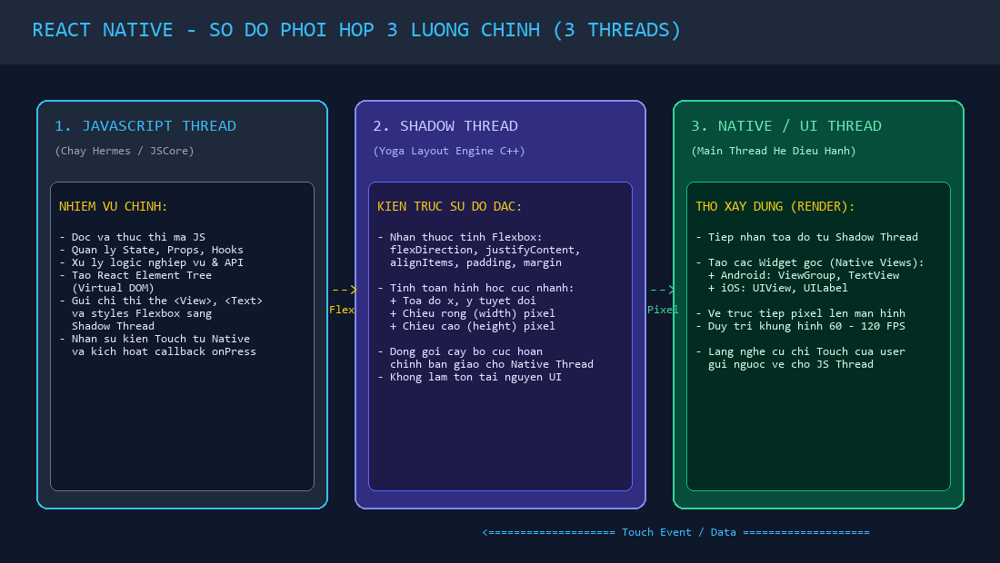
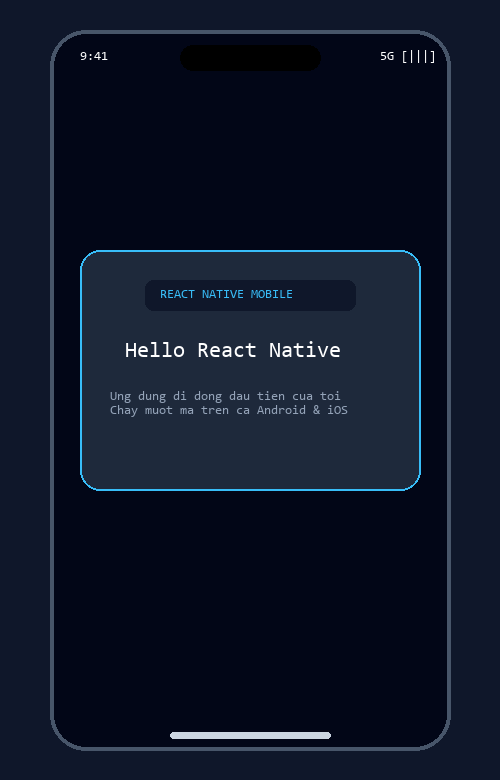

# BÀI LUYỆN TẬP 5 - PHẦN B: BÀI TẬP LUYỆN TẬP THỰC HÀNH

---

## 📋 MỤC LỤC THỰC HÀNH
1. **[Bài tập 1 (Mức dễ):](#bài-tập-1--mức-dễ)** Mô tả quy trình khởi động ứng dụng với sự phối hợp của 3 luồng (Native, JS, Shadow).
2. **[Bài tập 2 (Mức dễ - trung bình):](#bài-tập-2--mức-dễ-đến-trung-bình)** Xây dựng giao diện "Hello React Native" bằng `View` & `Text`; Giải thích chi tiết cơ chế chuyển đổi thành Native.
3. **[Bài tập 3 (Mức trung bình):](#bài-tập-3--mức-trung-bình)** Bảng Checklist kết nối thiết bị Android thật và phân tích các lỗi thường gặp khi build app.

---

## BÀI TẬP 1 – MỨC DỄ
> **Đề bài:**  
> Hãy viết một đoạn mô tả quy trình hoạt động của ứng dụng React Native khi người dùng mở ứng dụng và nhìn thấy giao diện đầu tiên trên màn hình. Trong bài làm, em cần nhắc đến Native thread, JavaScript thread và Shadow thread, đồng thời giải thích ngắn gọn luồng phối hợp giữa các thành phần này bằng ngôn ngữ của mình.

### 1. Sơ đồ luồng phối hợp giữa 3 luồng khi khởi động ứng dụng:


---

### 2. Đoạn văn mô tả chi tiết quy trình khởi động ứng dụng:

> *"Khi người dùng chạm ngón tay vào biểu tượng ứng dụng trên màn hình điện thoại, một chuỗi phối hợp nhịp nhàng và chuẩn xác giữa ba luồng chính sẽ lập tức được kích hoạt:*
> 
> *Đầu tiên, **Native Thread (Main UI Thread)** của hệ điều hành tiếp nhận lệnh khởi chạy, hiển thị màn hình chờ (Splash Screen) và lập tức khởi tạo môi trường máy ảo JavaScript (Hermes Engine). Tại đây, quyền điều khiển được trao cho **JavaScript Thread**.*
> 
> *Trên JavaScript Thread, toàn bộ gói mã nguồn JavaScript/React được nạp vào bộ nhớ. Lập trình viên đã viết sẵn các thành phần như `<View>`, `<Text>` cùng các quy tắc Flexbox. JS Engine nhanh chóng thông dịch logic, thiết lập trạng thái ban đầu và tạo ra cây giao diện ảo (Virtual DOM Tree). Khi đã xác định được các thẻ cần vẽ, JS Thread không thể tự vẽ ra màn hình mà gửi cấu trúc thẻ kèm các thông số style sang cho **Shadow Thread**.*
> 
> *Tại Shadow Thread, thư viện bố cục **Yoga Engine** (viết bằng C++) hoạt động như một 'kiến trúc sư đo đạc'. Yoga phân tích toàn bộ các quy tắc Flexbox (`justifyContent`, `alignItems`, `flexDirection`, `padding`) và chuyển đổi chúng thành các con số tọa độ hình học tuyệt đối: vị trí $(x, y)$, bề ngang $(width)$ và chiều cao $(height)$ tính theo đơn vị pixel của từng phần tử trên màn hình.*
> 
> *Cuối cùng, bản vẽ tọa độ hoàn chỉnh được bàn giao ngược lại cho **Native Thread**. Nhận được các thông số cụ thể này, Native Thread đóng vai trò là 'thợ xây', trực tiếp gọi các API đồ họa gốc của hệ điều hành (như `android.view.ViewGroup`, `TextView` trên Android hoặc `UIView`, `UILabel` trên iOS) để vẽ các điểm ảnh thực thụ lên màn hình. Toàn bộ chu trình này diễn ra chỉ trong vài phần trăm giây, màn hình Splash Screen biến mất và người dùng nhìn thấy giao diện trang chủ đầu tiên xuất hiện mượt mà trước mắt."*

---

## BÀI TẬP 2 – MỨC DỄ ĐẾN TRUNG BÌNH
> **Đề bài:**  
> Hãy tạo một ví dụ giao diện React Native đơn giản sử dụng hai thành phần View và Text để hiển thị nội dung "Hello React Native". Sau đó, em hãy giải thích đoạn mã đã viết: View dùng để làm gì, Text dùng để làm gì, phần style có tác dụng gì và vì sao các thành phần này có thể được chuyển thành thành phần giao diện native trên Android hoặc iOS.

### 1. Mã nguồn giao diện hoàn chỉnh (`App.js`)

```jsx
import React from 'react';
import { StyleSheet, Text, View, SafeAreaView } from 'react-native';

const App = () => {
  return (
    <SafeAreaView style={styles.safeArea}>
      <View style={styles.container}>
        <View style={styles.card}>
          <Text style={styles.title}>Hello React Native</Text>
          <Text style={styles.subtitle}>Ứng dụng di động đầu tiên của tôi</Text>
        </View>
      </View>
    </SafeAreaView>
  );
};

const styles = StyleSheet.create({
  safeArea: {
    flex: 1,
    backgroundColor: '#0f172a', // Màu nền tối
  },
  container: {
    flex: 1,
    justifyContent: 'center',    // Căn giữa theo chiều dọc
    alignItems: 'center',        // Căn giữa theo chiều ngang
    padding: 20,
  },
  card: {
    backgroundColor: '#1e293b',
    borderRadius: 16,
    padding: 24,
    borderWidth: 1,
    borderColor: '#38bdf8',      // Viền xanh React
    alignItems: 'center',
    elevation: 8,               // Đổ bóng trên Android
    shadowColor: '#38bdf8',      // Đổ bóng trên iOS
    shadowOffset: { width: 0, height: 4 },
    shadowOpacity: 0.3,
    shadowRadius: 10,
  },
  title: {
    fontSize: 26,
    fontWeight: 'bold',
    color: '#ffffff',
    marginBottom: 8,
  },
  subtitle: {
    fontSize: 14,
    color: '#94a3b8',
  },
});

export default App;
```

#### Hình ảnh minh họa giao diện khi hiển thị trên điện thoại:


---

### 2. Giải thích chi tiết các thành phần trong đoạn mã

| Thành phần | Vai trò và tác dụng kỹ thuật |
| :--- | :--- |
| **`View` dùng để làm gì?** | - Là **khối vùng chứa cơ bản nhất (Container Component)** trong React Native, tương đương với thẻ `<div>` trên Web.<br>- `View` dùng để gom nhóm các phần tử con, phân chia bố cục giao diện (Layout), tạo các khối thẻ (Card), tạo khoảng đệm (Padding) và hỗ trợ hệ thống Flexbox. Mọi giao diện phức tạp đều được xây dựng từ các thẻ `View` lồng nhau. |
| **`Text` dùng để làm gì?** | - Là **thành phần duy nhất được phép hiển thị chữ/văn bản** lên màn hình trong React Native (khác với Web có thể gõ chữ tự do trong `<div>`, React Native bắt buộc mọi chuỗi ký tự phải nằm bên trong thẻ `<Text>...</Text>`).<br>- Hỗ trợ các thuộc tính riêng cho văn bản như cỡ chữ (`fontSize`), độ đậm (`fontWeight`), màu sắc (`color`), căn lề và giới hạn số dòng hiển thị (`numberOfLines`). |
| **Phần `style` có tác dụng gì?** | - Định nghĩa toàn bộ hình thức thẩm mỹ và vị trí hình học của component thông qua đối tượng `StyleSheet.create()`.<br>- Cung cấp cơ chế bố cục **Flexbox** (`flex: 1`, `justifyContent: 'center'`, `alignItems: 'center'`) giúp giao diện tự động co giãn vừa vặn trên mọi kích thước màn hình từ điện thoại nhỏ đến máy tính bảng.<br>- `StyleSheet.create` còn giúp tối ưu hóa bộ nhớ bằng cách gán ID số cho từng bộ style thay vì tạo mới object liên tục mỗi lần re-render. |

---

### 3. Vì sao các thành phần này được chuyển thành giao diện Native trên Android và iOS?

- **Không render thành HTML:** Khi ứng dụng chạy, React Native không hề tạo ra các thẻ HTML `<div>` hay `<p>` trong trình duyệt.
- **Cơ chế ánh xạ thành phần bản địa (Native Component Mapping):**
  - Khi JavaScript thông báo cần tạo một `<View>`, tầng cầu nối sẽ gọi hàm khởi tạo widget gốc:
    - Trên **Android**: Tạo một đối tượng Java/Kotlin lớp `android.view.ViewGroup`.
    - Trên **iOS**: Tạo một đối tượng Objective-C/Swift lớp `UIView` thuộc bộ framework `UIKit`.
  - Khi JavaScript thông báo cần tạo một `<Text>`, tầng cầu nối sẽ gọi:
    - Trên **Android**: Tạo một widget `android.widget.TextView`.
    - Trên **iOS**: Tạo một widget `UILabel`.
- **Kết quả thực tế:** Vì thành phẩm hiển thị cuối cùng chính là các widget bản địa do chính hệ điều hành vẽ ra, nên người dùng sẽ có được cảm giác chạm, tốc độ cuộn, font chữ và hiệu năng mượt mà 100% như ứng dụng gốc Native.

---

## BÀI TẬP 3 – MỨC TRUNG BÌNH
> **Đề bài:**  
> Hãy lập checklist chuẩn bị thiết bị Android thật để build và chạy một ứng dụng React Native. Checklist cần trình bày đầy đủ các bước từ bật Developer Mode, bật USB Debugging, kết nối cáp USB, cấp quyền tin cậy cho máy tính, kiểm tra bằng `adb devices`, đến chạy lệnh `npx react-native run-android`. Sau khi hoàn thành checklist, hãy viết thêm một đoạn ngắn giải thích những lỗi thường gặp nếu thiết bị chưa được nhận diện hoặc chưa được mở khóa.

### 1. BẢNG CHECKLIST CHUẨN BỊ THIẾT BỊ ANDROID THẬT

| Bước | Hạng mục thực hiện | Thao tác chi tiết trên thiết bị / máy tính | Trạng thái kiểm tra |
| :---: | :--- | :--- | :---: |
| **1** | **Bật Chế độ nhà phát triển (Developer Mode)** | Mở **Cài đặt** $\rightarrow$ **Thông tin điện thoại** $\rightarrow$ **Thông tin phần mềm** $\rightarrow$ Chạm **7 lần liên tục** vào dòng **Số hiệu bản dựng (Build number)** cho đến khi máy báo *"Bạn đã là nhà phát triển"*. | 🔲 Hoàn thành |
| **2** | **Bật Gỡ lỗi USB (USB Debugging)** | Quay lại **Cài đặt** $\rightarrow$ Vào mục **Tùy chọn cho nhà phát triển (Developer options)** $\rightarrow$ Tìm và gạt BẬT mục **Gỡ lỗi qua USB (USB Debugging)**. | 🔲 Hoàn thành |
| **3** | **Kết nối cáp USB chất lượng tốt** | Cắm cáp kết nối điện thoại vào cổng USB của máy tính (ưu tiên cổng USB phía sau thùng máy hoặc dùng cáp sạc chính hãng có hỗ trợ truyền dữ liệu, không dùng cáp chỉ sạc). Chọn chế độ kết nối là **Truyền tệp (File Transfer / MTP)**. | 🔲 Hoàn thành |
| **4** | **Cấp quyền tin cậy RSA cho máy tính** | Nhìn vào màn hình điện thoại, khi thấy hộp thoại *"Cho phép gỡ lỗi USB từ máy tính này?"*, tích chọn **"Luôn cho phép từ máy tính này"** $\rightarrow$ Bấm **Cho phép (OK)**. | 🔲 Hoàn thành |
| **5** | **Kiểm tra nhận diện thiết bị qua ADB** | Mở Terminal trên máy tính, gõ lệnh: `adb devices`. Đảm bảo danh sách hiện mã máy kèm chữ **`device`** (Ví dụ: `R58M32ABCDE device`). | 🔲 Hoàn thành |
| **6** | **Chuyển tiếp cổng kết nối Metro Bundler** | Gõ lệnh: `adb reverse tcp:8081 tcp:8081` để điện thoại có thể tải được gói mã nguồn JavaScript từ máy chủ máy tính qua cáp USB. | 🔲 Hoàn thành |
| **7** | **Mở khóa màn hình điện thoại** | Vuốt mở khóa màn hình điện thoại, để màn hình luôn sáng trong suốt quá trình build. | 🔲 Hoàn thành |
| **8** | **Thực thi lệnh build và chạy ứng dụng** | Tại thư mục dự án trên máy tính, chạy lệnh: `npx react-native run-android` (hoặc `npm run android`). Ứng dụng sẽ được tự động cài đặt và mở lên trên điện thoại. | 🔲 Hoàn thành |

---

### 2. Phân tích các lỗi thường gặp trong quá trình kết nối và build

#### a. Lỗi thiết bị báo trạng thái `unauthorized` khi gõ `adb devices`:
- **Hiện tượng:** Terminal hiển thị mã thiết bị kèm chữ `unauthorized` thay vì `device`.
- **Nguyên nhân:** Người dùng chưa bấm xác nhận *"Cho phép gỡ lỗi USB"* trên màn hình điện thoại, hoặc khóa mã hóa RSA giữa máy tính và điện thoại đã bị lỗi thời.
- **Cách khắc phục:** 
  1. Rút cáp USB ra và cắm lại, mở khóa màn hình điện thoại để hộp thoại xác nhận hiện lên và bấm "Cho phép".
  2. Nếu không hiện, gõ lệnh khởi động lại ADB daemon trên máy tính:
     ```bash
     adb kill-server
     adb start-server
     adb devices
     ```

#### b. Lỗi danh sách `adb devices` hoàn toàn trống trơn (Không tìm thấy máy):
- **Nguyên nhân:**
  1. Sử dụng sợi cáp USB kém chất lượng (loại cáp "chỉ sạc" - charge only, không có đường truyền data).
  2. Máy tính Windows chưa cài đặt Driver USB phù hợp cho dòng máy điện thoại đó (**OEM USB Drivers** của Samsung, Xiaomi, Google Pixel,...).
- **Cách khắc phục:** Đổi cáp USB chính hãng, cắm sang cổng USB khác trên máy tính, và tải bộ Driver từ trang chủ của hãng sản xuất điện thoại cài vào Windows.

#### c. Lỗi ứng dụng cài đặt thành công nhưng không tự mở hoặc crash ngay khi mở (Do màn hình bị khóa):
- **Hiện tượng:** Terminal báo lỗi `Command failed: adb shell am start...` hoặc ứng dụng cài xong bị treo ở màn hình trắng/đỏ báo không kết nối được tới `http://localhost:8081`.
- **Nguyên nhân:** 
  - Trong quá trình build, điện thoại bị tắt màn hình hoặc đang ở trạng thái khóa bảo mật. Android kích hoạt chính sách bảo vệ ngăn các tiến trình từ bên ngoài tự ý mở màn hình ứng dụng chạy ngầm.
  - Chưa chạy lệnh chuyển tiếp cổng `adb reverse tcp:8081 tcp:8081`, khiến điện thoại không thể kết nối tới máy chủ Metro Bundler chạy trên máy tính.
- **Cách khắc phục:** Luôn giữ màn hình điện thoại sáng và mở khóa (có thể bật tùy chọn *"Không khóa màn hình khi đang sạc"* trong Developer Options), đồng thời chạy lệnh `adb reverse` trước khi build.
