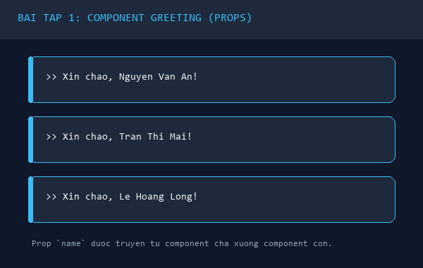
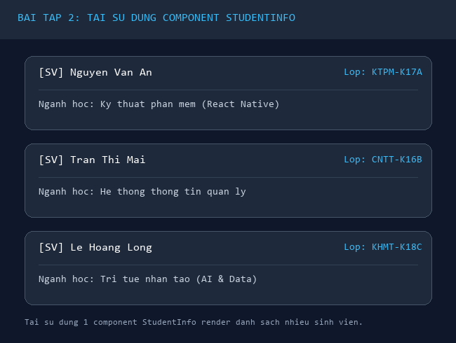
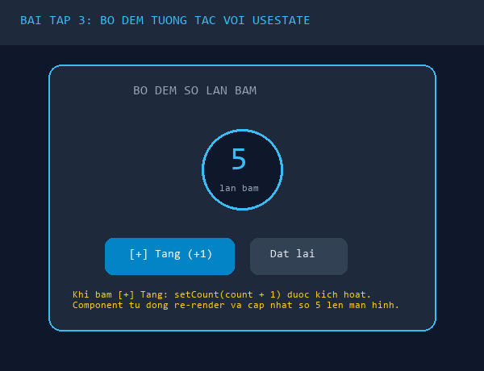
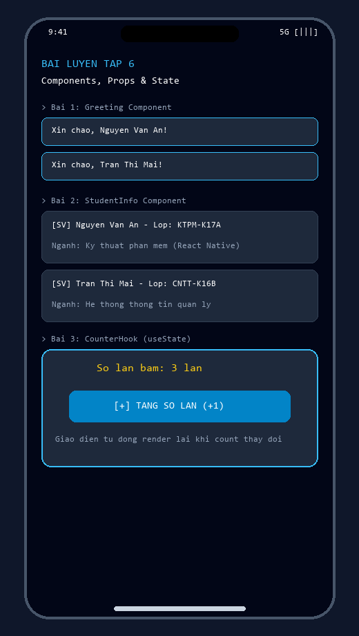

# BÀI LUYỆN TẬP 6 - PHẦN B: BÀI TẬP LUYỆN TẬP THỰC HÀNH

---

## 📋 MỤC LỤC THỰC HÀNH
1. **[Bài tập 1 (Mức dễ):](#bài-tập-1--mức-dễ)** Xây dựng Functional Component `Greeting` truyền dữ liệu bằng Props.
2. **[Bài tập 2 (Mức dễ - trung bình):](#bài-tập-2--mức-dễ-đến-trung-bình)** Xây dựng Component `StudentInfo` và tái sử dụng để hiển thị danh sách sinh viên.
3. **[Bài tập 3 (Mức trung bình):](#bài-tập-3--mức-trung-bình)** Xây dựng Component `CounterHook` sử dụng Hook `useState` để quản lý số lần bấm và kích hoạt Re-render.
4. **[Mã nguồn App.js tích hợp toàn diện:](#mã-nguồn-appjs-tích-hợp)** Mã nguồn kết nối cả 3 bài tập trên cùng một giao diện chuẩn.

---

## BÀI TẬP 1 – MỨC DỄ
> **Đề bài:**  
> Anh/chị hãy tạo một Functional Component có tên `Greeting`. Component này nhận vào một prop là `name` và hiển thị dòng chữ chào mừng người dùng, ví dụ: "Xin chào, Nguyễn Văn A!". Sau đó import component này vào `App.js` và sử dụng ít nhất hai lần với hai tên khác nhau. Bài tập này giúp người học hiểu cách tạo component đơn giản và truyền dữ liệu bằng props.

### 1. Mã nguồn component `Greeting.js`
Đường dẫn file: `components/Greeting.js`

```jsx
import React from 'react';
import { StyleSheet, Text, View } from 'react-native';

/**
 * BÀI TẬP 1: COMPONENT GREETING
 * Nhận prop `name` từ component cha và hiển thị lời chào mừng
 */
const Greeting = ({ name }) => {
  return (
    <View style={styles.card}>
      <Text style={styles.greetingText}>
        👋 Xin chào, <Text style={styles.highlightName}>{name}</Text>!
      </Text>
    </View>
  );
};

const styles = StyleSheet.create({
  card: {
    backgroundColor: '#1e293b', // Nền slate tối
    paddingVertical: 14,
    paddingHorizontal: 20,
    borderRadius: 12,
    marginVertical: 6,
    borderLeftWidth: 4,
    borderLeftColor: '#38bdf8', // Viền nhấn xanh ngọc
  },
  greetingText: {
    fontSize: 16,
    color: '#e2e8f0',
  },
  highlightName: {
    fontWeight: 'bold',
    color: '#38bdf8',
  },
});

export default Greeting;
```

### 2. Cách sử dụng trong `App.js`:
```jsx
import Greeting from './components/Greeting';

// Sử dụng nhiều lần với các giá trị prop name khác nhau:
<Greeting name="Nguyễn Văn An" />
<Greeting name="Trần Thị Mai" />
<Greeting name="Lê Hoàng Long" />
```

### 3. Giải thích kiến thức:
- **Props là gì?** Props (viết tắt của *Properties*) là phương thức truyền dữ liệu từ component cha (`App.js`) xuống component con (`Greeting`).
- **Tính bất biến (Read-only):** Component `Greeting` chỉ đọc giá trị `name` để hiển thị ra màn hình mà không được phép thay đổi giá trị của prop này.
- **Destructuring Props:** Cú pháp `const Greeting = ({ name }) => ...` giúp bóc tách trực tiếp thuộc tính `name` từ đối tượng props truyền vào một cách ngắn gọn.

### 4. Hình ảnh minh họa kết quả:


---

## BÀI TẬP 2 – MỨC DỄ ĐẾN TRUNG BÌNH
> **Đề bài:**  
> Anh/chị hãy xây dựng một component `StudentInfo` để hiển thị thông tin sinh viên gồm họ tên, lớp và ngành học. Các thông tin này được truyền từ component cha xuống component con thông qua props. Sau đó, trong `App.js`, hãy tạo nhiều `StudentInfo` khác nhau để hiển thị danh sách sinh viên. Bài tập này giúp rèn luyện khả năng tái sử dụng component và tổ chức giao diện thành các phần nhỏ.

### 1. Mã nguồn component `StudentInfo.js`
Đường dẫn file: `components/StudentInfo.js`

```jsx
import React from 'react';
import { StyleSheet, Text, View } from 'react-native';

/**
 * BÀI TẬP 2: COMPONENT STUDENTINFO
 * Nhận các props: `fullName`, `className`, `major` từ component cha
 * và hiển thị thẻ thông tin sinh viên dạng Card
 */
const StudentInfo = ({ fullName, className, major }) => {
  return (
    <View style={styles.studentCard}>
      <View style={styles.headerRow}>
        <Text style={styles.avatarIcon}>🎓</Text>
        <View style={styles.nameContainer}>
          <Text style={styles.nameText}>{fullName}</Text>
          <Text style={styles.badgeText}>Lớp: {className}</Text>
        </View>
      </View>
      <View style={styles.divider} />
      <View style={styles.infoRow}>
        <Text style={styles.label}>Ngành học:</Text>
        <Text style={styles.value}>{major}</Text>
      </View>
    </View>
  );
};

const styles = StyleSheet.create({
  studentCard: {
    backgroundColor: '#1e293b',
    borderRadius: 14,
    padding: 16,
    marginVertical: 6,
    borderWidth: 1,
    borderColor: '#334155',
    shadowColor: '#000',
    shadowOffset: { width: 0, height: 2 },
    shadowOpacity: 0.2,
    shadowRadius: 4,
    elevation: 3,
  },
  headerRow: {
    flexDirection: 'row',
    alignItems: 'center',
    marginBottom: 10,
  },
  avatarIcon: {
    fontSize: 28,
    marginRight: 12,
  },
  nameContainer: {
    flex: 1,
  },
  nameText: {
    fontSize: 17,
    fontWeight: 'bold',
    color: '#ffffff',
    marginBottom: 2,
  },
  badgeText: {
    fontSize: 13,
    color: '#38bdf8',
    fontWeight: '600',
  },
  divider: {
    height: 1,
    backgroundColor: '#334155',
    marginVertical: 8,
  },
  infoRow: {
    flexDirection: 'row',
    justifyContent: 'space-between',
    alignItems: 'center',
  },
  label: {
    fontSize: 14,
    color: '#94a3b8',
  },
  value: {
    fontSize: 14,
    fontWeight: '500',
    color: '#f8fafc',
  },
});

export default StudentInfo;
```

### 2. Cách sử dụng trong `App.js`:
```jsx
import StudentInfo from './components/StudentInfo';

// 1. Dùng trực tiếp từng component:
<StudentInfo 
  fullName="Nguyễn Văn An" 
  className="KTPM-K17A" 
  major="Kỹ thuật phần mềm (Mobile React Native)" 
/>
<StudentInfo 
  fullName="Trần Thị Mai" 
  className="CNTT-K16B" 
  major="Hệ thống thông tin quản lý" 
/>

// 2. Hoặc render động từ mảng dữ liệu với map():
{studentsList.map(student => (
  <StudentInfo
    key={student.id}
    fullName={student.fullName}
    className={student.className}
    major={student.major}
  />
))}
```

### 3. Ý nghĩa của tính tái sử dụng Component:
- **Tách biệt mối quan tâm (Separation of Concerns):** `StudentInfo` chỉ lo việc hiển thị đẹp mắt một thẻ sinh viên, còn `App.js` quản lý danh sách dữ liệu.
- **Tiết kiệm mã nguồn:** Không cần lặp lại hàng chục dòng mã thẻ `<View>`, `<Text>` và các thuộc tính style cho từng sinh viên. Khi muốn sửa bố cục thẻ sinh viên, ta chỉ cần chỉnh sửa tại file `StudentInfo.js`.

### 4. Hình ảnh minh họa kết quả:


---

## BÀI TẬP 3 – MỨC TRUNG BÌNH
> **Đề bài:**  
> Anh/chị hãy tạo một component `CounterHook` sử dụng `useState` để quản lý giá trị đếm ban đầu là 0. Giao diện cần có phần hiển thị số lần bấm và một nút "Tăng". Mỗi khi người dùng bấm nút, giá trị đếm tăng thêm 1 và giao diện được cập nhật lại. Bài tập này giúp người học hiểu rõ mối quan hệ giữa state, hàm cập nhật state và quá trình render lại giao diện.

### 1. Mã nguồn component `CounterHook.js`
Đường dẫn file: `components/CounterHook.js`

```jsx
import React, { useState } from 'react';
import { StyleSheet, Text, View, TouchableOpacity } from 'react-native';

/**
 * BÀI TẬP 3: COMPONENT COUNTERHOOK
 * Sử dụng Hook `useState` để quản lý biến trạng thái đếm `count`
 */
const CounterHook = () => {
  // 1. Khai báo state lưu số lần bấm với giá trị ban đầu là 0
  const [count, setCount] = useState(0);

  // 2. Hàm xử lý khi bấm nút "Tăng"
  const handleIncrement = () => {
    setCount(prevCount => prevCount + 1);
  };

  // 3. Hàm xử lý đặt lại về 0
  const handleReset = () => {
    setCount(0);
  };

  return (
    <View style={styles.counterCard}>
      <Text style={styles.titleLabel}>BỘ ĐẾM SỐ LẦN TƯƠNG TÁC</Text>
      
      {/* Vùng hiển thị số lần bấm */}
      <View style={styles.displayCircle}>
        <Text style={styles.countNumber}>{count}</Text>
        <Text style={styles.unitText}>lần bấm</Text>
      </View>

      {/* Vùng nút bấm tương tác */}
      <View style={styles.buttonRow}>
        <TouchableOpacity 
          style={styles.incrementButton} 
          onPress={handleIncrement}
          activeOpacity={0.8}
        >
          <Text style={styles.incrementButtonText}>⚡ Tăng (+1)</Text>
        </TouchableOpacity>

        {count > 0 && (
          <TouchableOpacity 
            style={styles.resetButton} 
            onPress={handleReset}
            activeOpacity={0.8}
          >
            <Text style={styles.resetButtonText}>↺ Đặt lại</Text>
          </TouchableOpacity>
        )}
      </View>

      <Text style={styles.hintText}>
        💡 Mỗi lần bấm nút, hàm setCount được gọi kích hoạt quá trình Re-render giao diện.
      </Text>
    </View>
  );
};

const styles = StyleSheet.create({
  counterCard: {
    backgroundColor: '#1e293b',
    borderRadius: 16,
    padding: 24,
    alignItems: 'center',
    marginVertical: 10,
    borderWidth: 1,
    borderColor: '#38bdf8',
    elevation: 4,
    shadowColor: '#38bdf8',
    shadowOffset: { width: 0, height: 4 },
    shadowOpacity: 0.2,
    shadowRadius: 8,
  },
  titleLabel: {
    fontSize: 13,
    fontWeight: '700',
    color: '#94a3b8',
    letterSpacing: 1.2,
    marginBottom: 16,
  },
  displayCircle: {
    width: 110,
    height: 110,
    borderRadius: 55,
    backgroundColor: '#0f172a',
    justifyContent: 'center',
    alignItems: 'center',
    borderWidth: 2,
    borderColor: '#38bdf8',
    marginBottom: 20,
  },
  countNumber: {
    fontSize: 40,
    fontWeight: 'bold',
    color: '#38bdf8',
  },
  unitText: {
    fontSize: 12,
    color: '#64748b',
    marginTop: -4,
  },
  buttonRow: {
    flexDirection: 'row',
    gap: 12,
    marginBottom: 14,
  },
  incrementButton: {
    backgroundColor: '#0284c7',
    paddingVertical: 12,
    paddingHorizontal: 28,
    borderRadius: 10,
    elevation: 2,
  },
  incrementButtonText: {
    color: '#ffffff',
    fontSize: 16,
    fontWeight: 'bold',
  },
  resetButton: {
    backgroundColor: '#334155',
    paddingVertical: 12,
    paddingHorizontal: 16,
    borderRadius: 10,
  },
  resetButtonText: {
    color: '#e2e8f0',
    fontSize: 15,
    fontWeight: '600',
  },
  hintText: {
    fontSize: 12,
    color: '#94a3b8',
    textAlign: 'center',
    fontStyle: 'italic',
    marginTop: 4,
  },
});

export default CounterHook;
```

### 2. Mối quan hệ giữa State, Hàm cập nhật và Quá trình Re-render:
```
[1. Người dùng bấm nút "Tăng"]
               |
               v
[2. Kích hoạt sự kiện onPress={handleIncrement}]
               |
               v
[3. Gọi hàm cập nhật state: setCount(prevCount => prevCount + 1)]
               |
               v
[4. React phát hiện State thay đổi -> Lên lịch Re-render Component]
               |
               v
[5. Hàm CounterHook được gọi lại với giá trị count mới (ví dụ: 1 -> 2)]
               |
               v
[6. Virtual DOM tính toán sai khác và Native Thread vẽ lại con số mới lên màn hình!]
```

### 3. Hình ảnh minh họa kết quả:


---

## 📱 MÃ NGUỒN APP.JS TÍCH HỢP TOÀN DIỆN

Dưới đây là mã nguồn của file `App.js` tổng hợp cả 3 bài tập trên cùng một màn hình hoàn chỉnh:

```jsx
import React from 'react';
import {
  StyleSheet,
  Text,
  View,
  SafeAreaView,
  ScrollView,
  StatusBar,
} from 'react-native';

import Greeting from './components/Greeting';
import StudentInfo from './components/StudentInfo';
import CounterHook from './components/CounterHook';

const App = () => {
  const studentsList = [
    {
      id: '1',
      fullName: 'Nguyễn Văn An',
      className: 'KTPM-K17A',
      major: 'Kỹ thuật phần mềm (Mobile React Native)',
    },
    {
      id: '2',
      fullName: 'Trần Thị Mai',
      className: 'CNTT-K16B',
      major: 'Hệ thống thông tin quản lý',
    },
    {
      id: '3',
      fullName: 'Lê Hoàng Long',
      className: 'KHMT-K18C',
      major: 'Trí tuệ nhân tạo (AI & Data Science)',
    },
  ];

  return (
    <SafeAreaView style={styles.safeArea}>
      <StatusBar barStyle="light-content" backgroundColor="#0f172a" />
      <ScrollView contentContainerStyle={styles.scrollContainer}>
        {/* Header */}
        <View style={styles.header}>
          <Text style={styles.headerBadge}>BÀI LUYỆN TẬP 6</Text>
          <Text style={styles.headerTitle}>React Native Components & State</Text>
          <Text style={styles.headerDesc}>
            Làm quen với Props, Component tái sử dụng và Hook useState
          </Text>
        </View>

        {/* Bài 1: Greeting Component */}
        <View style={styles.section}>
          <Text style={styles.sectionTitle}>📌 Bài 1: Greeting Component (Props)</Text>
          <Greeting name="Nguyễn Văn An" />
          <Greeting name="Trần Thị Mai" />
          <Greeting name="Lê Hoàng Long" />
        </View>

        {/* Bài 2: StudentInfo Component */}
        <View style={styles.section}>
          <Text style={styles.sectionTitle}>📌 Bài 2: Danh sách Sinh viên (StudentInfo)</Text>
          {studentsList.map(student => (
            <StudentInfo
              key={student.id}
              fullName={student.fullName}
              className={student.className}
              major={student.major}
            />
          ))}
        </View>

        {/* Bài 3: CounterHook Component */}
        <View style={styles.section}>
          <Text style={styles.sectionTitle}>📌 Bài 3: Bộ đếm tương tác (useState Hook)</Text>
          <CounterHook />
        </View>
      </ScrollView>
    </SafeAreaView>
  );
};

const styles = StyleSheet.create({
  safeArea: {
    flex: 1,
    backgroundColor: '#0f172a',
  },
  scrollContainer: {
    padding: 20,
    paddingBottom: 40,
  },
  header: {
    alignItems: 'center',
    marginBottom: 24,
    paddingBottom: 16,
    borderBottomWidth: 1,
    borderBottomColor: '#1e293b',
  },
  headerBadge: {
    fontSize: 12,
    fontWeight: '800',
    color: '#38bdf8',
    backgroundColor: 'rgba(56, 189, 248, 0.1)',
    paddingHorizontal: 12,
    paddingVertical: 4,
    borderRadius: 20,
    letterSpacing: 1.5,
    marginBottom: 8,
  },
  headerTitle: {
    fontSize: 22,
    fontWeight: 'bold',
    color: '#ffffff',
    textAlign: 'center',
    marginBottom: 6,
  },
  headerDesc: {
    fontSize: 14,
    color: '#94a3b8',
    textAlign: 'center',
  },
  section: {
    marginBottom: 28,
  },
  sectionTitle: {
    fontSize: 17,
    fontWeight: '700',
    color: '#f8fafc',
    marginBottom: 10,
  },
});

export default App;
```

### Hình ảnh mockup tổng hợp toàn bộ ứng dụng trên Smartphone:

