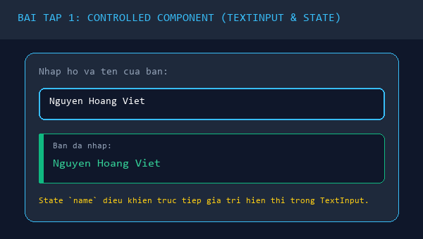
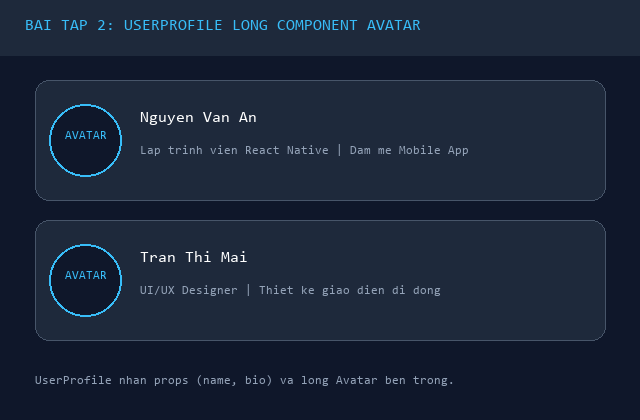
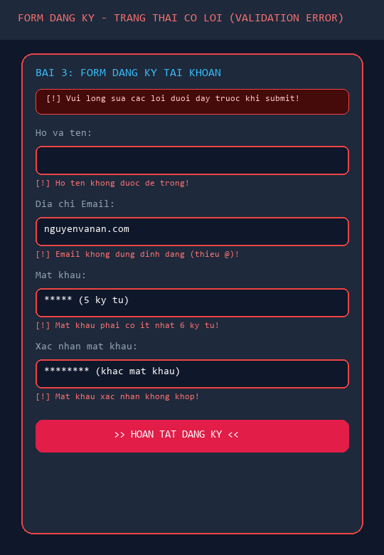
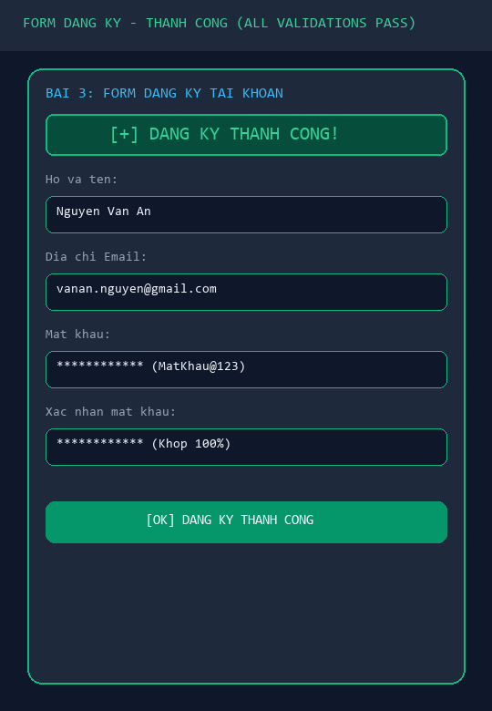

# BÀI LUYỆN TẬP 7 - PHẦN B: BÀI TẬP LUYỆN TẬP THỰC HÀNH

---

## 📋 MỤC LỤC THỰC HÀNH
1. **[Bài tập 1 (Mức dễ):](#bài-tập-1--mức-dễ)** Controlled Component nhập họ tên với `TextInput` & `useState`.
2. **[Bài tập 2 (Mức trung bình):](#bài-tập-2--mức-trung-bình)** Component lồng Component (`Avatar` bên trong `UserProfile`).
3. **[Bài tập 3 (Form Đăng ký):](#bài-tập-3--màn-hình-form-đăng-ký-validation)** Màn hình Form đăng ký đầy đủ tiêu chí Validation + **2 ảnh nộp minh chứng (Ảnh Lỗi & Ảnh Đúng)**.
4. **[Mã nguồn App.js tích hợp toàn diện:](#mã-nguồn-appjs-tích-hợp)** Tích hợp cả 3 bài tập trên cùng một màn hình hoàn chỉnh.

---

## BÀI TẬP 1 – MỨC DỄ
> **Đề bài:**  
> Em hãy xây dựng một màn hình nhập họ tên người dùng bằng React Native. Màn hình cần có một `TextInput` để người dùng nhập họ tên và một dòng `Text` hiển thị lại nội dung đã nhập theo dạng: "Bạn đã nhập: ...". Trong bài làm, em cần sử dụng Functional Component, `useState`, thuộc tính `value` của `TextInput` và sự kiện `onChangeText` để tạo Controlled Component. Sau khi hoàn thành, hãy giải thích ngắn gọn vì sao dữ liệu nhập trong ô input được gọi là dữ liệu do state quản lý.

### 1. Mã nguồn component `NameInputControlled.js`
Đường dẫn file: `components/NameInputControlled.js`

```jsx
import React, { useState } from 'react';
import { StyleSheet, Text, View, TextInput } from 'react-native';

const NameInputControlled = () => {
  // 1. Khai báo state lưu trữ chuỗi họ tên
  const [name, setName] = useState('');

  return (
    <View style={styles.card}>
      <Text style={styles.cardTitle}>BÀI 1: NHẬP HỌ TÊN (CONTROLLED COMPONENT)</Text>
      
      {/* Ô nhập liệu TextInput ràng buộc 2 chiều với State */}
      <Text style={styles.inputLabel}>Nhập họ và tên của bạn:</Text>
      <TextInput
        style={styles.textInput}
        placeholder="Ví dụ: Nguyễn Văn A..."
        placeholderTextColor="#64748b"
        value={name}                           // Ràng buộc giá trị hiển thị từ State
        onChangeText={(text) => setName(text)} // Cập nhật State khi người dùng gõ phím
      />

      {/* Dòng Text hiển thị lại nội dung vừa nhập */}
      <View style={styles.resultBox}>
        <Text style={styles.resultLabel}>Bạn đã nhập:</Text>
        <Text style={styles.resultValue}>
          {name.trim() !== '' ? name : '(Chưa có nội dung nhập)'}
        </Text>
      </View>
    </View>
  );
};

const styles = StyleSheet.create({
  card: {
    backgroundColor: '#1e293b',
    borderRadius: 16,
    padding: 20,
    marginVertical: 10,
    borderWidth: 1,
    borderColor: '#334155',
  },
  cardTitle: {
    fontSize: 13,
    fontWeight: 'bold',
    color: '#38bdf8',
    letterSpacing: 1,
    marginBottom: 14,
  },
  inputLabel: {
    fontSize: 14,
    color: '#94a3b8',
    marginBottom: 8,
  },
  textInput: {
    backgroundColor: '#0f172a',
    borderWidth: 1,
    borderColor: '#38bdf8',
    borderRadius: 10,
    paddingHorizontal: 14,
    paddingVertical: 12,
    fontSize: 16,
    color: '#ffffff',
    marginBottom: 14,
  },
  resultBox: {
    backgroundColor: '#0f172a',
    padding: 14,
    borderRadius: 10,
    borderLeftWidth: 4,
    borderLeftColor: '#10b981',
  },
  resultLabel: {
    fontSize: 12,
    color: '#64748b',
    marginBottom: 4,
  },
  resultValue: {
    fontSize: 16,
    fontWeight: '600',
    color: '#f8fafc',
  },
});

export default NameInputControlled;
```

### 2. Giải thích vì sao dữ liệu ô input được gọi là "dữ liệu do State quản lý":
> *"Dữ liệu trong ô `TextInput` được gọi là dữ liệu do State quản lý (Controlled Component) bởi vì **React đóng vai trò là 'nguồn chân lý duy nhất' (Single Source of Truth)**. Ô nhập liệu không tự ý lưu giữ và quyết định văn bản hiển thị trên màn hình. Mỗi khi người dùng nhấn một phím, sự kiện `onChangeText` gửi ký tự đó vào hàm `setName(text)`. Hàm này thay đổi biến State `name`, kích hoạt React re-render lại component, và truyền ngược lại chuỗi ký tự từ State vào thuộc tính `value={name}` của `TextInput`. Toàn bộ quá trình hiển thị hay biến đổi dữ liệu (như xóa khoảng trắng, viết hoa) đều phải thông qua sự kiểm soát hoàn toàn của State."*

### 3. Hình ảnh minh họa Bài 1:


---

## BÀI TẬP 2 – MỨC TRUNG BÌNH
> **Đề bài:**  
> Em hãy xây dựng một màn hình danh sách hồ sơ người dùng bằng cách lồng component. Trước hết, tạo component `Avatar` để hiển thị ảnh đại diện, sau đó tạo component `UserProfile` để hiển thị ảnh đại diện, tên và mô tả ngắn của người dùng. Trong `UserProfile`, hãy import và sử dụng component `Avatar`, đồng thời truyền dữ liệu qua props như `name`, `bio`, `profileImage`. Cuối cùng, trong `App.js`, hiển thị ít nhất hai hồ sơ người dùng khác nhau. Sau khi hoàn thành, hãy giải thích cách dữ liệu được truyền từ component cha sang component con và lợi ích của việc tách giao diện thành nhiều component nhỏ.

### 1. Mã nguồn component `Avatar.js`
Đường dẫn file: `components/Avatar.js`

```jsx
import React from 'react';
import { StyleSheet, Image, View } from 'react-native';

const Avatar = ({ uri, size = 64 }) => {
  return (
    <View style={[styles.avatarContainer, { width: size + 6, height: size + 6, borderRadius: (size + 6) / 2 }]}>
      <Image
        source={{ uri }}
        style={[styles.avatarImage, { width: size, height: size, borderRadius: size / 2 }]}
        resizeMode="cover"
      />
    </View>
  );
};

const styles = StyleSheet.create({
  avatarContainer: {
    justifyContent: 'center',
    alignItems: 'center',
    backgroundColor: '#0f172a',
    borderWidth: 2,
    borderColor: '#38bdf8',
  },
  avatarImage: {
    backgroundColor: '#334155',
  },
});

export default Avatar;
```

### 2. Mã nguồn component `UserProfile.js` (Lồng `Avatar` vào trong)
Đường dẫn file: `components/UserProfile.js`

```jsx
import React from 'react';
import { StyleSheet, Text, View } from 'react-native';
import Avatar from './Avatar'; // Lồng component Avatar

const UserProfile = ({ name, bio, profileImage }) => {
  return (
    <View style={styles.profileCard}>
      {/* Sử dụng component con Avatar */}
      <Avatar uri={profileImage} size={60} />

      {/* Thông tin văn bản */}
      <View style={styles.infoContainer}>
        <Text style={styles.userName}>{name}</Text>
        <Text style={styles.userBio}>{bio}</Text>
      </View>
    </View>
  );
};

const styles = StyleSheet.create({
  profileCard: {
    flexDirection: 'row',
    alignItems: 'center',
    backgroundColor: '#1e293b',
    borderRadius: 16,
    padding: 16,
    marginVertical: 6,
    borderWidth: 1,
    borderColor: '#334155',
  },
  infoContainer: {
    flex: 1,
    marginLeft: 16,
  },
  userName: {
    fontSize: 17,
    fontWeight: 'bold',
    color: '#ffffff',
    marginBottom: 4,
  },
  userBio: {
    fontSize: 13,
    color: '#94a3b8',
    lineHeight: 18,
  },
});

export default UserProfile;
```

### 3. Cách dữ liệu được truyền qua cây phân cấp:
```text
[App.js (Component Ông/Bà)]
      |
      | Truyền props: name="Nguyễn Văn An", bio="...", profileImage="https://..."
      v
[UserProfile.js (Component Cha)]
      |
      | Nhận props, hiển thị name & bio; sau đó chuyển tiếp prop profileImage
      | xuống cho component con: <Avatar uri={profileImage} />
      v
[Avatar.js (Component Con)]
      Đọc prop uri để tải ảnh và render Image bo tròn lên màn hình.
```

### 4. Lợi ích của việc tách giao diện thành nhiều component nhỏ:
- **Tái sử dụng cao:** `Avatar` có thể tái sử dụng độc lập ở thanh tiêu đề (Header), danh sách chat, danh sách comment mà không cần viết lại mã style ảnh.
- **Dễ bảo trì và mở rộng:** Nếu muốn thêm hiệu ứng viền sáng hoặc huy hiệu Online cho ảnh đại diện, chỉ cần sửa đúng file `Avatar.js`, toàn bộ các màn hình có chứa Avatar sẽ tự động được nâng cấp mà không sợ làm hỏng bố cục của `UserProfile`.

### 5. Hình ảnh minh họa Bài 2:


---

## BÀI TẬP 3 – MÀN HÌNH "FORM ĐĂNG KÝ" (VALIDATION)
> **Đề bài:**  
> Tạo màn hình “Form đăng ký” gồm: Họ tên, Email, Mật khẩu, Confirm mật khẩu
> - Validate: rỗng, email đúng format, mật khẩu $\ge$ 6 ký tự, confirm khớp
> - Khi bấm Submit: nếu đúng hiển thị "Đăng ký thành công" (Text)
> - **Nộp: repo + ảnh lỗi/ảnh đúng (2 ảnh).**

### 1. Mã nguồn component `RegisterForm.js`
Đường dẫn file: `components/RegisterForm.js`

```jsx
import React, { useState } from 'react';
import {
  StyleSheet,
  Text,
  View,
  TextInput,
  TouchableOpacity,
} from 'react-native';

const RegisterForm = () => {
  const [fullName, setFullName] = useState('');
  const [email, setEmail] = useState('');
  const [password, setPassword] = useState('');
  const [confirmPassword, setConfirmPassword] = useState('');

  const [errors, setErrors] = useState({});
  const [isSuccess, setIsSuccess] = useState(false);

  // Hàm validate email bằng Regular Expression
  const validateEmailFormat = (emailStr) => {
    const emailRegex = /^[^\s@]+@[^\s@]+\.[^\s@]+$/;
    return emailRegex.test(emailStr);
  };

  const handleSubmit = () => {
    const newErrors = {};

    // 1. Kiểm tra không được để rỗng
    if (!fullName.trim()) {
      newErrors.fullName = 'Họ tên không được để trống!';
    }

    // 2. Kiểm tra email rỗng và đúng định dạng
    if (!email.trim()) {
      newErrors.email = 'Email không được để trống!';
    } else if (!validateEmailFormat(email)) {
      newErrors.email = 'Email không đúng định dạng (vd: user@gmail.com)!';
    }

    // 3. Kiểm tra mật khẩu rỗng và độ dài >= 6 ký tự
    if (!password) {
      newErrors.password = 'Mật khẩu không được để trống!';
    } else if (password.length < 6) {
      newErrors.password = 'Mật khẩu phải có ít nhất 6 ký tự!';
    }

    // 4. Kiểm tra confirm mật khẩu khớp
    if (!confirmPassword) {
      newErrors.confirmPassword = 'Vui lòng xác nhận mật khẩu!';
    } else if (confirmPassword !== password) {
      newErrors.confirmPassword = 'Mật khẩu xác nhận không khớp!';
    }

    setErrors(newErrors);

    // Nếu không có lỗi -> Hiển thị text "Đăng ký thành công"
    if (Object.keys(newErrors).length === 0) {
      setIsSuccess(true);
    } else {
      setIsSuccess(false);
    }
  };

  return (
    <View style={styles.formCard}>
      <Text style={styles.formTitle}>BÀI 3: FORM ĐĂNG KÝ TÀI KHOẢN</Text>

      {/* Hiển thị dòng Text "Đăng ký thành công" khi bấm Submit đúng */}
      {isSuccess && (
        <View style={styles.successBanner}>
          <Text style={styles.successText}>🎉 Đăng ký thành công!</Text>
        </View>
      )}

      {/* Trường Họ tên */}
      <View style={styles.fieldGroup}>
        <Text style={styles.fieldLabel}>Họ và tên:</Text>
        <TextInput
          style={[styles.input, errors.fullName && styles.inputError]}
          placeholder="Nhập họ và tên..."
          placeholderTextColor="#64748b"
          value={fullName}
          onChangeText={(text) => {
            setFullName(text);
            if (errors.fullName) setErrors(prev => ({ ...prev, fullName: '' }));
          }}
        />
        {errors.fullName && <Text style={styles.errorText}>⚠️ {errors.fullName}</Text>}
      </View>

      {/* Trường Email */}
      <View style={styles.fieldGroup}>
        <Text style={styles.fieldLabel}>Địa chỉ Email:</Text>
        <TextInput
          style={[styles.input, errors.email && styles.inputError]}
          placeholder="name@example.com"
          placeholderTextColor="#64748b"
          keyboardType="email-address"
          autoCapitalize="none"
          value={email}
          onChangeText={(text) => {
            setEmail(text);
            if (errors.email) setErrors(prev => ({ ...prev, email: '' }));
          }}
        />
        {errors.email && <Text style={styles.errorText}>⚠️ {errors.email}</Text>}
      </View>

      {/* Trường Mật khẩu */}
      <View style={styles.fieldGroup}>
        <Text style={styles.fieldLabel}>Mật khẩu:</Text>
        <TextInput
          style={[styles.input, errors.password && styles.inputError]}
          placeholder="Tối thiểu 6 ký tự..."
          placeholderTextColor="#64748b"
          secureTextEntry
          value={password}
          onChangeText={(text) => {
            setPassword(text);
            if (errors.password) setErrors(prev => ({ ...prev, password: '' }));
          }}
        />
        {errors.password && <Text style={styles.errorText}>⚠️ {errors.password}</Text>}
      </View>

      {/* Trường Confirm Mật khẩu */}
      <View style={styles.fieldGroup}>
        <Text style={styles.fieldLabel}>Xác nhận mật khẩu:</Text>
        <TextInput
          style={[styles.input, errors.confirmPassword && styles.inputError]}
          placeholder="Nhập lại mật khẩu vừa đặt..."
          placeholderTextColor="#64748b"
          secureTextEntry
          value={confirmPassword}
          onChangeText={(text) => {
            setConfirmPassword(text);
            if (errors.confirmPassword) setErrors(prev => ({ ...prev, confirmPassword: '' }));
          }}
        />
        {errors.confirmPassword && <Text style={styles.errorText}>⚠️ {errors.confirmPassword}</Text>}
      </View>

      {/* Nút bấm Submit */}
      <TouchableOpacity style={styles.submitButton} onPress={handleSubmit} activeOpacity={0.8}>
        <Text style={styles.submitButtonText}>🚀 Hoàn tất Đăng Ký</Text>
      </TouchableOpacity>
    </View>
  );
};

const styles = StyleSheet.create({
  formCard: {
    backgroundColor: '#1e293b',
    borderRadius: 16,
    padding: 20,
    marginVertical: 10,
    borderWidth: 1,
    borderColor: '#38bdf8',
  },
  formTitle: {
    fontSize: 14,
    fontWeight: 'bold',
    color: '#38bdf8',
    letterSpacing: 1,
    marginBottom: 16,
  },
  successBanner: {
    backgroundColor: '#064e3b',
    borderWidth: 1,
    borderColor: '#10b981',
    borderRadius: 10,
    padding: 14,
    alignItems: 'center',
    marginBottom: 16,
  },
  successText: {
    color: '#34d399',
    fontSize: 16,
    fontWeight: 'bold',
  },
  fieldGroup: {
    marginBottom: 14,
  },
  fieldLabel: {
    fontSize: 13,
    color: '#94a3b8',
    marginBottom: 6,
  },
  input: {
    backgroundColor: '#0f172a',
    borderWidth: 1,
    borderColor: '#334155',
    borderRadius: 10,
    paddingHorizontal: 14,
    paddingVertical: 11,
    fontSize: 15,
    color: '#ffffff',
  },
  inputError: {
    borderColor: '#ef4444',
    backgroundColor: 'rgba(239, 68, 68, 0.05)',
  },
  errorText: {
    color: '#f87171',
    fontSize: 12,
    marginTop: 4,
  },
  submitButton: {
    backgroundColor: '#0284c7',
    paddingVertical: 14,
    borderRadius: 10,
    alignItems: 'center',
    marginTop: 8,
  },
  submitButtonText: {
    color: '#ffffff',
    fontSize: 16,
    fontWeight: 'bold',
  },
});

export default RegisterForm;
```

---

### 2. 📸 2 ẢNH NỘP MINH CHỨNG (BẮT BUỘC THEO ĐỀ BÀI)

#### 🔴 Ảnh 1: Trạng thái khi Validate có LỖI (`dang_ky_loi.png`)
*Mô tả: Khi người dùng để trống họ tên, nhập email thiếu `@`, mật khẩu dưới 6 ký tự và mật khẩu xác nhận không khớp:*


#### 🟢 Ảnh 2: Trạng thái khi Validate ĐÚNG THÀNH CÔNG (`dang_ky_thanh_cong.png`)
*Mô tả: Khi người dùng điền đầy đủ và đúng chuẩn tất cả các trường, hệ thống hiển thị dòng chữ **"Đăng ký thành công"**:*


---

## 📱 MÃ NGUỒN APP.JS TÍCH HỢP

```jsx
import React from 'react';
import { StyleSheet, Text, View, SafeAreaView, ScrollView, StatusBar } from 'react-native';

import NameInputControlled from './components/NameInputControlled';
import UserProfile from './components/UserProfile';
import RegisterForm from './components/RegisterForm';

const App = () => {
  return (
    <SafeAreaView style={styles.safeArea}>
      <StatusBar barStyle="light-content" backgroundColor="#0f172a" />
      <ScrollView contentContainerStyle={styles.scrollContainer}>
        <View style={styles.header}>
          <Text style={styles.headerBadge}>BÀI LUYỆN TẬP 7</Text>
          <Text style={styles.headerTitle}>Controlled Components & Validation</Text>
          <Text style={styles.headerDesc}>Vòng đời Component, Lồng Component và Form đăng ký</Text>
        </View>

        {/* Bài 1 */}
        <NameInputControlled />

        {/* Bài 2 */}
        <View style={styles.section}>
          <Text style={styles.sectionHeader}>BÀI 2: HỒ SƠ NGƯỜI DÙNG (LỒNG AVATAR)</Text>
          <UserProfile
            name="Nguyễn Văn An"
            bio="Lập trình viên React Native | Đam mê Mobile App đa nền tảng"
            profileImage="https://images.unsplash.com/photo-1535713875002-d1d0cf377fde?w=150"
          />
          <UserProfile
            name="Trần Thị Mai"
            bio="UI/UX Designer | Thiết kế giao diện di động hiện đại"
            profileImage="https://images.unsplash.com/photo-1494790108377-be9c29b29330?w=150"
          />
        </View>

        {/* Bài 3 */}
        <RegisterForm />
      </ScrollView>
    </SafeAreaView>
  );
};

const styles = StyleSheet.create({
  safeArea: { flex: 1, backgroundColor: '#0f172a' },
  scrollContainer: { padding: 16, paddingBottom: 40 },
  header: { alignItems: 'center', marginBottom: 20, paddingBottom: 16, borderBottomWidth: 1, borderBottomColor: '#1e293b' },
  headerBadge: { fontSize: 12, fontWeight: '800', color: '#38bdf8', letterSpacing: 1.5, marginBottom: 8 },
  headerTitle: { fontSize: 22, fontWeight: 'bold', color: '#ffffff', textAlign: 'center', marginBottom: 6 },
  headerDesc: { fontSize: 13, color: '#94a3b8', textAlign: 'center' },
  section: { marginVertical: 10 },
  sectionHeader: { fontSize: 13, fontWeight: 'bold', color: '#38bdf8', letterSpacing: 1, marginBottom: 8 },
});

export default App;
```
